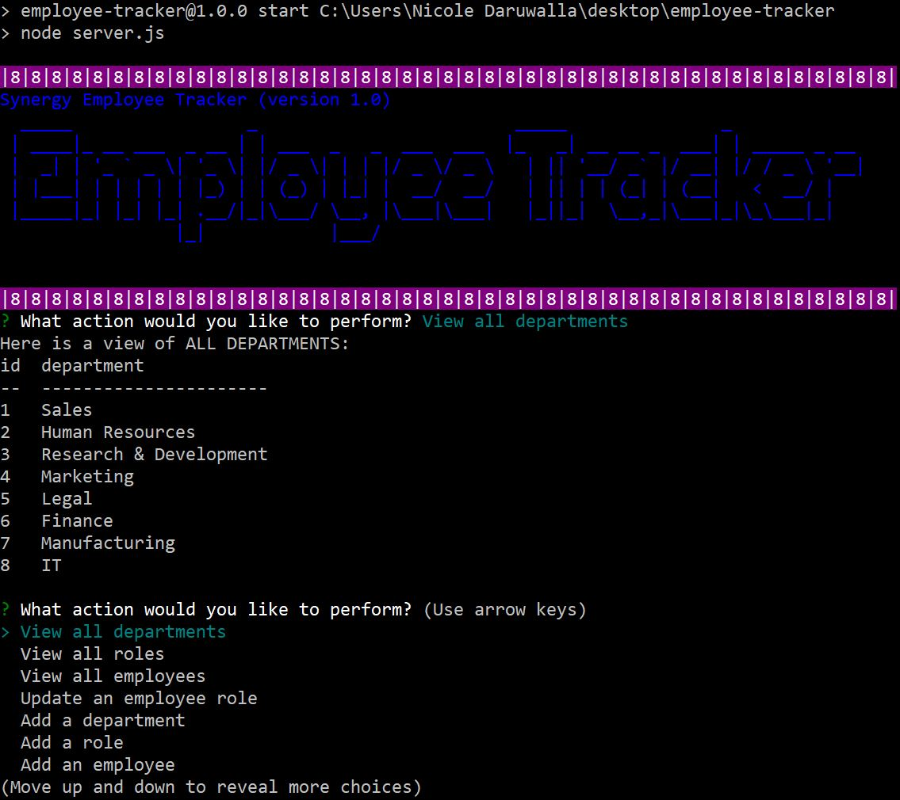

# Synergy Employee Tracker

<!-- image credit: this image is from icons8-->

  ## Description
  The **Synergy Employee Tracker** interface makes it easy for non-developers to view and interact with employee information stored in a database. My challenge in making this Content Management System (CMS) was to architect and build a solution for managing a company's employees using node, inquirer, and MySQL.

  ### Link to Video Demonstration of Completed Application 
  [Employee Tracker](https://youtu.be/AoY1eS2IexU)
  <!-- enter youtube link after recording -->

  ### Link to Application Repository on GitHub 
  [Employee Tracker](https://github.com/NDaruwalla/employee-tracker)

  ### Screen Capture
  Page
  


  ## Table of Contents
  - [Description](#description)
  - [User Story/Stories](#story)
  - [Acceptance Criteria](#criteria)
  - [Tools](#tools)
  - [Installation](#installation)
  - [Use](#use)
  - [License](#license)
  - [Contributors](#contributors)
  - [References](#references)
  - [Tests](#tests)
  - [Questions](#questions)

  ## User Story/Stories
  ```md
  As a business owner
  I want to be able to view and manage the departments, roles, and employees in my company
  So that I can organize and plan my business
  ```

  ## Key Features
 
  The command-line application allows the user to:
  - Add departments, roles, employees
  - View departments, roles, employees
  - Update employee roles
  - Update employee managers *(bonus - not included in this version)*
  - View employees by manager *(bonus - not included in this version)*
  - Delete departments, roles, and employees *(bonus - not included in this version)*
  - View the total utilized budget of a department -- ie the combined salaries of all employees in that department *(bonus - not included in this version)*
  
  ## Acceptance Criteria
   This following gif provided to me **from the assignment README.md file** illustrates the acceptance criteria and shows how the application should work:
   
   

  ## Tools
  The tools used to create this application include: Visual Studio Code, Node.js, JavaScript, Git Bash, MySQL, MySQL Workbench, and Screencastify.

  ## Installation

  1. [Node JS](https://nodejs.org/en/download/) is an asynchronous event-driven JavaScript runtime, designed to build scalable network applications
  2. [MySQL](https://www.npmjs.com/package/mysql) is used to connect to the MySQL database and perform queries
  3. [npm inquirer](https://www.npmjs.com/package/inquirer/v/0.2.3) is used to interact with the user via the command-line
  4. [npm console.table](https://www.npmjs.com/package/console.table) is used to print MySQL rows to the console
  5. [npm chalk](https://www.npmjs.com/package/chalk) is used to style text color and background in console
  6. [npm figlet](https://www.npmjs.com/package/figlet) is used to turn a string of text into ASCII Art
  7. [npm nodmon](https://www.npmjs.com/package/nodemon) automatically restarts the node application when file changes in the directory are detected
 

  ## Use
  The Synergy Employee Tracker is designed for non-developers to view and interact with employee information stored in a database.

  ## License
  MIT
  
  [](https://opensource.org/licenses/MIT)  Click badge for license description.
  
  ## Contributors
  Nicole Daruwalla 

  ## References
  The following references were used to create this application: 
  * #10 Homework assignment: Object-Oriented Programming: Team Profile Generator
  * [NPM Overview](https://www.npmjs.com/)
  * [NPM Docs](https://docs.npmjs.com/)
  * [SQL Bolt](https://sqlbolt.com/)
  * [NPM Chalk](https://www.youtube.com/watch?v=czsc2rsS3NY)
  * other websites as noted in the code comments


  ## Tests
  No tests are included at this time.

  ## Questions
  If you have questions or need help with this application:

  Contact me on GitHub:
  [ndaruwalla](https://github.com/ndaruwalla)
 
  Or, via [Email](mailto:nicole.daruwalla@gmail.com)


